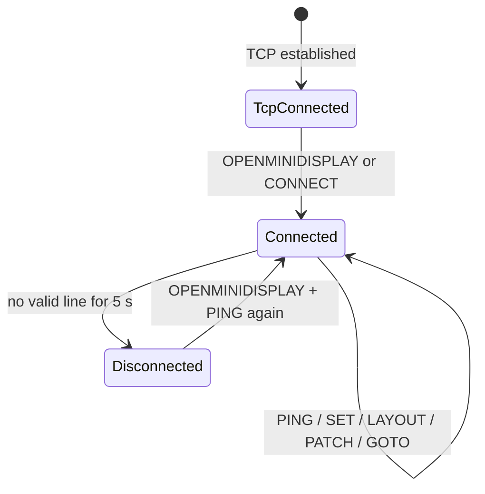

# OpenMiniDisplay Controller Integration (Layout v2)

**Audience:** Developers building **PC, server, or embedded controllers** (Python, Node.js, Go, C#, Home Assistant, etc.) that drive an OpenMiniDisplay Android device over TCP.

**Purpose:** Implement a TCP client for layout v2 (`pages` → `cards` → `components`), live data updates, paging, and optional per-card Lua scripts on the device.

| Meta | Value |
|------|-------|
| Layout schema | **v2 only** — [`layout.v2.schema.json`](schemas/layout.v2.schema.json) |
| Transport port | **15180** |
| Encoding | UTF-8 |
| Framing | One command per line, terminated by `\n` |
| Display app | OpenMiniDisplay Android (`minSdk 28`) |

> **Normative keywords:** MUST, MUST NOT, SHOULD, MAY (RFC 2119 sense).  
> **Out of scope:** Layout v1 (`widgets`) is not supported.

---

## 0. Device & network prerequisites

Before writing a PC client:

| Requirement | Detail |
|-------------|--------|
| App installed | OpenMiniDisplay APK running; foreground service listening on **15180** |
| Same network | Controller and phone on the same LAN (or routed path to device IP) |
| Device IP | Phone Wi‑Fi settings, router DHCP list, or `adb shell ip route` during USB debug |
| App visible once | User should open the app after install so the service starts; on battery, deep idle stops the listener until the user wakes the device |
| Permissions | Display may prompt for notification / write-settings on first launch (brightness control) |

**Smoke test from a PC (bash):**

```bash
printf 'OPENMINIDISPLAY\nPING\nSET title/title Hello from PC\n' | nc <display-ip> 15180
```

**Smoke test (Python, from this repo):**

```bash
python3 docs/examples/reference_client.py ping <display-ip>
python3 docs/examples/reference_client.py demo <display-ip>
```

---

## 1. PC controller quick start

### 1.1 Three integration levels

| Level | PC sends | Device does | Use when |
|-------|----------|-------------|----------|
| **A. Data only** | `OPENMINIDISPLAY` + `PING` + `SET card/comp …` | Uses built-in default layout | Fastest start; dashboard-style updates |
| **B. Layout + data** | `LAYOUT {…}` then `SET …` + `PING` | Renders your structure; you own all values | Custom dashboards, charts, multi-page |
| **C. Layout + Lua card** | `LAYOUT` with `script` on card(s), then **`PING` only** | Card script runs timers, HTTP, handles button/toggle on device | Autonomous widgets; PC is thin session keeper |

### 1.2 Minimal session (every controller MUST)

```text
1. TCP connect to <display-ip>:15180
2. send "OPENMINIDISPLAY\n"          # wake + CONNECTED
3. send "PING\n"                     # start heartbeat window
4. send commands (SET / LAYOUT / …)
5. send "PING\n" at least every 2 s while connected
6. keep one socket open (new connection replaces the old one)
```

### 1.3 Python skeleton

```python
import json, socket, time

HOST, PORT = "192.168.1.23", 15180
PING_SEC = 2.0

def send(sock, line: str) -> None:
    sock.sendall((line.rstrip("\n") + "\n").encode("utf-8"))

sock = socket.create_connection((HOST, PORT))
send(sock, "OPENMINIDISPLAY")
send(sock, "PING")

# Level A: update default layout
send(sock, "SET title/title Server Room")
send(sock, "SET metric/metric 23.5")

# Level B: push custom layout (single-line JSON)
layout = json.load(open("minimal_layout.json", encoding="utf-8"))
send(sock, "LAYOUT " + json.dumps(layout, separators=(",", ":"), ensure_ascii=False))
send(sock, "PING")
send(sock, "SET title/title Production")

while True:
    send(sock, "PING")
    # … more SET commands …
    time.sleep(PING_SEC)
```

### 1.4 What the PC controls vs the device

| Concern | PC controller | Device (app / Lua) |
|---------|---------------|-------------------|
| Layout structure | `LAYOUT` / `PATCH` | Parses v2 JSON |
| Display values | `SET card/comp value` | Updates UI |
| Toggle label / checked / button enabled | Optional via Lua `set_prop` on device | `button` / `toggle` clicks → card `on_event` |
| Timers, HTTP fetch, button logic | — | Card `script` (Luaj) |
| Page navigation | `GOTO index\|pageId` | Animated pager |
| Heartbeat / connected state | `PING` ≤ every 2 s | 5 s timeout → DISCONNECTED |

There is **no TCP response body**. Success is inferred from an open socket and continued acceptance of commands.

### 1.5 Repo artifacts

| Artifact | Path |
|----------|------|
| **This spec** | `docs/CONTROLLER_INTEGRATION.md` |
| Examples index | `docs/examples/README.md` |
| Python reference client | `docs/examples/reference_client.py` |
| Sample layout JSON | `docs/examples/minimal_layout.json` |
| Sample Lua card script | `docs/examples/sample_card.lua` |
| Layout JSON Schema | `docs/schemas/layout.v2.schema.json` |
| Bash layout loop | `scripts/layout-test.sh` |
| Bash widget SET loop | `scripts/widget-test.sh` |
| Bash chart SET loop | `scripts/chart-test.sh` |
| Bash Lua card demo | `scripts/card-script-test.sh` |
| Bash connect test | `scripts/connect-test.sh` |

---

## 2. Transport

| Property | Requirement |
|----------|-------------|
| Protocol | TCP |
| Host | IP of the Android device on LAN |
| Port | **15180** |
| Byte order | N/A (text) |
| Encoding | **UTF-8** |
| Message delimiter | **LF (`\n`)** — one command per line |
| Responses | Display **does not** send text replies (fire-and-forget) |
| Concurrent clients | **Single active session** — a new TCP connection replaces the previous one |

Controllers MUST NOT wait for an ACK before sending the next command. Liveness is inferred from the TCP connection staying open and periodic heartbeats.

---

## 3. Connection lifecycle (controller view)



### Timing constants

| Constant | Value | Notes |
|----------|-------|-------|
| `HEARTBEAT_TIMEOUT` | **5000 ms** | No valid command → display state **DISCONNECTED** |
| `PING_INTERVAL` (recommended) | **≤ 2000 ms** | Keeps session **CONNECTED** |
| `LOW_POWER_DELAY` | 60 s after disconnect | Display-side only |
| `DIM_DURATION` | 10 s linear fade | Display-side only |

### Commands that refresh the heartbeat

Any successfully handled line among:

- `OPENMINIDISPLAY` / `CONNECT` (handshake)
- `PING`
- `SET …` (parsed successfully)
- `LAYOUT …` (valid JSON, ≥1 page)
- `PATCH …` (valid JSON, ≥1 page)
- `GOTO …` (valid index or page id)

---

## 4. Command reference

### 4.1 Grammar

```bnf
line        := command LF
command     := handshake | heartbeat | set | layout | patch | goto
handshake   := "OPENMINIDISPLAY" | "CONNECT" [suffix]
heartbeat   := "PING" [suffix]
set         := "SET" SP component-path SP value
layout      := "LAYOUT" SP json-object
patch       := "PATCH" SP json-object
goto        := "GOTO" SP target
component-path := card-id "/" component-id
card-id     := non-empty token without "/"
component-id := non-empty token without "/"
value       := any UTF-8 text (may contain spaces)
target      := page-index | page-id
page-index  := decimal integer (0-based)
page-id     := non-empty string matching a page "id" in current layout
suffix      := optional extra characters (ignored for CONNECT/PING prefix match)
SP          := one ASCII space
```

**Case:** Command keywords are matched **case-insensitively** for `SET`, `PUSH`, `LAYOUT`, `PATCH`, `GOTO`, `OPENMINIDISPLAY`, `PING`, and `CONNECT` prefix.

### 4.2 Handshake

| Send | Display effect |
|------|----------------|
| `OPENMINIDISPLAY` | **CONNECTED** — wake screen, max brightness, show dashboard |
| `CONNECT` | Same as handshake (prefix match) |

Example:

```text
OPENMINIDISPLAY
```

### 4.3 Heartbeat

| Send | Display effect |
|------|----------------|
| `PING` | Extends **CONNECTED** by 5 s |

Example:

```text
PING
```

### 4.4 SET (component data)

```text
SET <cardId>/<componentId> <value>
```

- Target MUST contain **`/`** separating card id from component id.
- **First ASCII space** after `SET` separates path from `value`.
- **Everything after the first space** (trimmed) is `value`, including embedded spaces.

| Send | Display effect |
|------|----------------|
| `SET weather/temp 23.5` | Updates component `temp` in card `weather` |
| Path without `/` | Rejected (logged, no update) |
| Invalid / blank value | Ignored (no error reply) |

Examples:

```text
SET title/title Hello World
SET dash/cpu 72
SET dash/line 10,20,15,30,25
SET dash/pie CPU:30,MEM:25,IO:20,NET:25
```

### 4.5 PUSH (binary assets)

```text
PUSH <assetId> <base64>
```

- Decodes standard base64 and writes to app cache as `assetId`.
- Use with `image` components: `SET <card>/<comp> asset:<assetId>` (after `PUSH`).
- One asset per line; suitable for GIFs and other binary media.

```text
PUSH mahiro.gif R0lGODlh…
SET mahiro/img asset:mahiro.gif
```

### 4.6 LAYOUT (replace structure)

```text
LAYOUT <json>
```

- `<json>` MUST be a **single-line** JSON object (no raw newlines inside the line).
- Replaces the entire layout.
- MUST contain at least one page.

| Send | Display effect |
|------|----------------|
| Valid layout JSON | Pages/grid/cards replaced; page index clamped; card scripts restarted |
| Invalid JSON / empty pages / version < 2 | Ignored |

### 4.7 PATCH (merge pages)

```text
PATCH <json>
```

- JSON shape: `{ "pages": [ … ] }`
- Each page is merged by **`id`**: existing page replaced, unknown page appended.

### 4.8 GOTO (switch page)

```text
GOTO <index>
GOTO <pageId>
```

| Send | Display effect |
|------|----------------|
| `GOTO 0` | First page (0-based), **animated** slide |
| `GOTO focus` | Page with `"id":"focus"`, animated |

Only meaningful when layout has **2+ pages**. With 1 page, display does not enable swipe; GOTO still updates internal index.

---

## 5. Layout schema v2 (structure)

Layout describes **where** cards and components are placed. Display values come from **`SET`** and/or **card Lua scripts** (not from layout JSON).

Validate with: [`docs/schemas/layout.v2.schema.json`](schemas/layout.v2.schema.json)

### 5.1 Top-level object

```json
{
  "version": 2,
  "pages": [ { "...": "..." } ]
}
```

| Field | Required | Description |
|-------|----------|-------------|
| `version` | **Yes** (must be ≥ 2) | Schema version |
| `pages` | **Yes** | Non-empty array of pages |

### 5.2 Page object

```json
{
  "id": "overview",
  "grid": { "rows": 3, "cols": 4, "gap": 8, "padding": 16 },
  "cards": [ { "...": "..." } ]
}
```

| Field | Default | Description |
|-------|---------|-------------|
| `grid.rows` | `1` | Grid rows (≥1) |
| `grid.cols` | `1` | Grid columns (≥1) |
| `grid.gap` | `8` | Gap dp between cells |
| `grid.padding` | `16` | Page padding dp |

### 5.3 Card object

```json
{
  "id": "weather",
  "row": 0,
  "col": 0,
  "rowSpan": 1,
  "colSpan": 1,
  "grid": { "rows": 3, "cols": 1, "gap": 4, "padding": 8 },
  "script": "function on_init() set('temp','--') end",
  "components": [ { "...": "..." } ]
}
```

| Field | Required | Description |
|-------|----------|-------------|
| `id` | Yes | Card id; used in `SET` path prefix |
| `row`, `col` | No (default `0`) | Page grid placement |
| `rowSpan`, `colSpan` | No (default `1`) | Page grid span |
| `grid` | No | Inner grid for components |
| `script` | No | Lua source; enables autonomous card runtime |
| `components` | **Yes** | Non-empty component list |

### 5.4 Component object

```json
{
  "id": "cpu",
  "type": "ring",
  "row": 0,
  "col": 0,
  "rowSpan": 1,
  "colSpan": 1,
  "style": "body",
  "label": "CPU"
}
```

| Field | Required | Values |
|-------|----------|--------|
| `id` | Yes | Used in `SET` as `<cardId>/<componentId>` |
| `type` | Yes | `text`, `metric`, `progress`, `ring`, `line`, `bar`, `pie`, `button`, `toggle`, `image` |
| `row`, `col` | Yes | 0-based inner grid origin |
| `rowSpan`, `colSpan` | No (default `1`) | Cell span |
| `style` | No | `headline`, `body`, `caption`, `metric` |
| `label` | No | Default label for charts / button / toggle |
| `checked` | No | Initial on-state for `toggle` (default `false`) |
| `align` | No | `start`, `center`, `end` — content alignment in grid cell |
| `fill` | No | `true` = use full cell (large ring/text/charts). Default `true` on borderless single-component pages |
| `fit` | No | `true` = auto-fit `text`/`metric` font to cell (implies centered) |
| `scale` | No | `0.2`–`1.0` — fraction of cell used by `ring` when `fill` (default `0.85`) |
| `showLabel` | No | `true`/`false` — override chart/ring label visibility |

### 5.5 Display rendering rules (for layout authors)

Controllers SHOULD design layouts knowing:

| Rule | Behavior |
|------|----------|
| Orientation | Landscape |
| Vertical scroll | **Not supported** — content clips |
| 1 page | No horizontal swipe |
| 2+ pages | Infinite horizontal swipe + page dots |
| 1 card on page, 1 component in card | **Borderless** full-screen |
| 2+ cards on page | Card chrome + page grid |
| 2+ components in card | Inner grid inside card |

### 5.6 Default on-device layout (data-only controllers)

If you **do not** send `LAYOUT`, the app ships this structure. Use these `SET` paths:

| Page `id` | Card `id` | Component `id` | Type | Example `SET` |
|-----------|-----------|----------------|------|----------------|
| `overview` | `title` | `title` | text | `SET title/title OpenMiniDisplay` |
| `overview` | `subtitle` | `subtitle` | text | `SET subtitle/subtitle Room A` |
| `overview` | `status` | `status` | text | `SET status/status Connected` |
| `overview` | `progress` | `progress` | progress | `SET progress/progress 65` |
| `overview` | `ring` | `ring` | ring | `SET ring/ring 72` |
| `overview` | `line` | `line` | line | `SET line/line 10,20,15,30` |
| `overview` | `bar` | `bar` | bar | `SET bar/bar 6,14,10,22` |
| `focus` | `metric` | `metric` | metric | `SET metric/metric 23.5` |
| `charts` | `pie` | `pie` | pie | `SET pie/pie CPU:30,MEM:25,IO:20` |
| `charts` | `footer` | `footer` | text | `SET footer/footer Updated` |

Navigate pages: `GOTO 0` (overview), `GOTO focus`, `GOTO 2`, etc.

### 5.7 Card Lua scripts (optional)

When a card includes a non-empty `script` field, the device runs it in **Luaj** (Lua 5.2 semantics) inside `RemoteDisplayService`.

**Lifecycle functions** (implement in script; host calls):

| Function | When |
|----------|------|
| `on_init()` | Card loaded / layout updated / resume from battery deep idle |
| `on_timer(name)` | After `every(seconds, name)` |
| `on_event(id, event, value?)` | IO component interaction |
| `on_destroy()` | Card unloaded / service stop |

**Host globals:**

| Function | Description |
|----------|-------------|
| `set(id, value)` | Update display component in this card |
| `set_prop(id, key, val)` | `label`, `enabled`, `checked`, `align`, `fill`, `fit`, `scale`, `showLabel` |
| `every(sec, name)` | Start repeating timer |
| `cancel(name)` | Stop timer |
| `http_get(url, fn)` | Async GET; `fn(status, body_table_or_nil, err_string)` |
| `local_time()` | Device local time as `HH:mm:ss` (24-hour) |
| `wake()` | Exit idle dim / restore dashboard brightness (equivalent to user touch while disconnected) |
| `log(msg)` | Logcat |

**IO events:**

| Component | `on_event` |
|-----------|------------|
| `button` | `on_event("btnId", "click")` |
| `toggle` | `on_event("toggleId", "change", "true"\|"false")` |

**Embedding script from a PC client:** the `script` field is a JSON string. Escape with your language’s JSON encoder (newlines → `\n`):

```python
import json
from pathlib import Path

script = Path("sample_card.lua").read_text(encoding="utf-8")
card = {
    "id": "demo",
    "row": 0, "col": 0,
    "grid": {"rows": 5, "cols": 1, "gap": 8, "padding": 8},
    "script": script,
    "components": [
        {"id": "status", "type": "text", "row": 0, "col": 0, "style": "headline"},
        {"id": "counter", "type": "metric", "row": 1, "col": 0},
        {"id": "refresh", "type": "button", "row": 3, "col": 0, "label": "Refresh"},
        {"id": "auto", "type": "toggle", "row": 4, "col": 0, "label": "Auto tick", "checked": True},
    ],
}
layout = {"version": 2, "pages": [{"id": "script_demo", "grid": {"rows": 1, "cols": 1, "padding": 16}, "cards": [card]}]}
send(sock, "LAYOUT " + json.dumps(layout, separators=(",", ":"), ensure_ascii=False))
```

After `LAYOUT`, send only `PING` — the script updates components locally (`set`, `every`, `http_get`). Re-sending the **same** layout restarts scripts (`on_init` runs again).

Scripts pause during **battery deep idle** (on battery, disconnected, after low-power timeout) and restart on wake.

When **plugged in**, disconnected, and card Lua **timers are still running** (e.g. clock tick), idle dim stops at ~20% brightness on the dashboard instead of navigating to pitch-black.

Example script: [`docs/examples/sample_card.lua`](examples/sample_card.lua).  
Bash test: `./scripts/card-script-test.sh <display-ip>`.  
Python: `python3 docs/examples/reference_client.py ping <display-ip>` after pushing a scripted layout.

---

## 6. Data formats (`SET` values)

Widget type is taken from **current layout** for that `cardId/componentId`. If not in layout, type is inferred from component id name.

| Type | Value format | Parsing |
|------|--------------|---------|
| `text`, `metric` | Any string | Used as-is |
| `progress`, `ring` | Number 0–100 | Optional `%` suffix; clamped 0–100 |
| `line`, `bar` | Comma-separated floats | `10, 20.5, 3` |
| `pie` | `label:value` pairs OR comma numbers | `CPU:30,MEM:70` or `30,70` → S1, S2… |
| `image` | `asset:<id>` after `PUSH`, or local `file://` path | Decoded file on device |
| `button`, `toggle` | Ignored for display value | Use `set_prop` from Lua or toggle UI |

---

## 7. Recommended client architecture

```text
OpenMiniDisplayClient
├── TcpConnection        # connect(), reconnect(), single socket
├── HeartbeatScheduler   # interval ≤ 2 s → PING
├── CommandWriter        # send_line(cmd) with UTF-8 + \n
├── LayoutStore          # optional local copy of last LAYOUT
└── DataCache            # card/comp path → last SET value (for reconnect replay)
```

### 7.1 Reconnect strategy (SHOULD)

1. On disconnect → exponential backoff reconnect.
2. After reconnect → `OPENMINIDISPLAY`.
3. If layout was customized → resend `LAYOUT …`.
4. Resend all cached `SET` values.
5. Restart heartbeat timer.

### 7.2 Threading

- One writer thread/coroutine serializing lines onto the socket is sufficient.
- Heartbeat and data updates MAY share the same queue.

---

## 8. Reference sessions

### 8.1 Default layout — data only (Level A)

Display ships with a default 3-page layout. Controller only sends data:

```text
OPENMINIDISPLAY
PING
SET title/title Server Room
SET metric/metric 23.5 C
SET progress/progress 65
PING
```

Or: `python3 docs/examples/reference_client.py demo <display-ip>`

### 8.2 Custom layout + live data (Level B)

```text
OPENMINIDISPLAY
LAYOUT {"version":2,"pages":[{"id":"dash","grid":{"rows":2,"cols":2,"gap":8,"padding":16},"cards":[{"id":"title","row":0,"col":0,"colSpan":2,"grid":{"rows":1,"cols":1,"padding":0},"components":[{"id":"title","type":"text","row":0,"col":0,"style":"headline"}]},{"id":"cpu","row":1,"col":0,"grid":{"rows":1,"cols":1,"padding":0},"components":[{"id":"cpu","type":"ring","row":0,"col":0}]},{"id":"mem","row":1,"col":1,"grid":{"rows":1,"cols":1,"padding":0},"components":[{"id":"mem","type":"progress","row":0,"col":0}]}]}]}
PING
SET title/title Production
SET cpu/cpu 72
SET mem/mem 54
PING
```

Or: `python3 docs/examples/reference_client.py push-layout <display-ip> --layout docs/examples/minimal_layout.json`

### 8.3 Multi-page carousel

```text
OPENMINIDISPLAY
LAYOUT {"version":2,"pages":[{"id":"a","grid":{"rows":1,"cols":1,"padding":0},"cards":[{"id":"metric","row":0,"col":0,"grid":{"rows":1,"cols":1,"padding":0},"components":[{"id":"metric","type":"metric","row":0,"col":0,"style":"metric"}]}]},{"id":"b","grid":{"rows":1,"cols":1,"padding":0},"cards":[{"id":"status","row":0,"col":0,"grid":{"rows":1,"cols":1,"padding":0},"components":[{"id":"status","type":"text","row":0,"col":0,"style":"headline"}]}]}]}
PING
SET metric/metric 100%
SET status/status All systems go
GOTO 0
PING
GOTO 1
PING
GOTO b
```

### 8.4 Autonomous Lua card (Level C)

Push layout with `script` on a card, then only heartbeat — device updates UI locally:

```text
OPENMINIDISPLAY
LAYOUT …
PING
PING
…
```

See `docs/examples/sample_card.lua`, `./scripts/card-script-test.sh <display-ip>`, and §5.7.

### 8.5 PATCH — update pages without full replace

```text
OPENMINIDISPLAY
PATCH {"pages":[{"id":"overview","grid":{"rows":1,"cols":1,"padding":16},"cards":[{"id":"status","row":0,"col":0,"grid":{"rows":1,"cols":1,"padding":0},"components":[{"id":"status","type":"text","row":0,"col":0,"style":"headline"}]}]}]}
PING
SET status/status Patched page
```

`PATCH` merges by page `id`; card scripts on affected cards are restarted.

---

## 9. Conformance checklist

Before shipping a controller client, verify:

- [ ] Connects to port **15180**
- [ ] Sends `OPENMINIDISPLAY` immediately after TCP connect
- [ ] Sends `PING` at least every **2 s** while connected
- [ ] `SET` uses `cardId/componentId` paths
- [ ] `SET` with spaces in value works (`SET title/title Hello World`)
- [ ] `LAYOUT` JSON is single-line UTF-8 with `"version":2`
- [ ] After reconnect, layout + data are replayed
- [ ] Handles display not responding (no ACK) without deadlock
- [ ] Tested with `docs/examples/reference_client.py` and/or `scripts/*-test.sh`

---

## 10. Versioning

| Layout schema | Status |
|---------------|--------|
| **v2** (`pages` → `cards` → `components`, optional `script`) | **Current** — `version` ≥ 2 required |

Controllers MUST send `"version": 2` in layout JSON. Unknown JSON fields SHOULD be ignored by forward-compatible clients.

---

## 11. Troubleshooting

| Symptom | Likely cause | Fix |
|---------|--------------|-----|
| Connection refused | App not running / deep idle / wrong IP | Open app on device; wake from battery saver; verify IP |
| Display dims after ~5 s | No `PING` / commands | Send heartbeat every ≤2 s |
| Updates ignored | Not connected / wrong path | Send `OPENMINIDISPLAY` first; use `cardId/componentId` from layout (see §5.6) |
| `SET title Hello` fails | Missing `/` in path | Use `SET title/title Hello` |
| `LAYOUT` has no effect | Invalid JSON, `version` < 2, or empty pages | Validate against `layout.v2.schema.json`; one line per command |
| Lua card shows `--` | Script error or session dropped | Check logcat `CardScript`; resend `LAYOUT`; keep `PING` alive |
| Button/toggle no script action | No `script` on card or wrong `on_event` id | Match component `id` in Lua; PC cannot inject clicks |
| Connection drops when reconnecting | Single-client design | Close old socket before opening new one |
| Cannot connect | Firewall / wrong IP | Same LAN; check device Wi‑Fi IP |
| Works once then stops (battery) | Battery deep idle | User wakes device (open app); reconnect and resend `LAYOUT` + data |

---

## 12. Related documents

| Document | Audience |
|----------|----------|
| [`AGENTS.md`](../AGENTS.md) | Agents modifying the **Android app** |
| [`README.md`](../README.md) | Human overview + license |
| [`LICENSE`](../LICENSE) | Apache-2.0 |

**Maintenance:** When the wire protocol or layout schema changes in the Android app, **`docs/CONTROLLER_INTEGRATION.md` MUST be updated in the same change** (see `AGENTS.md`).
