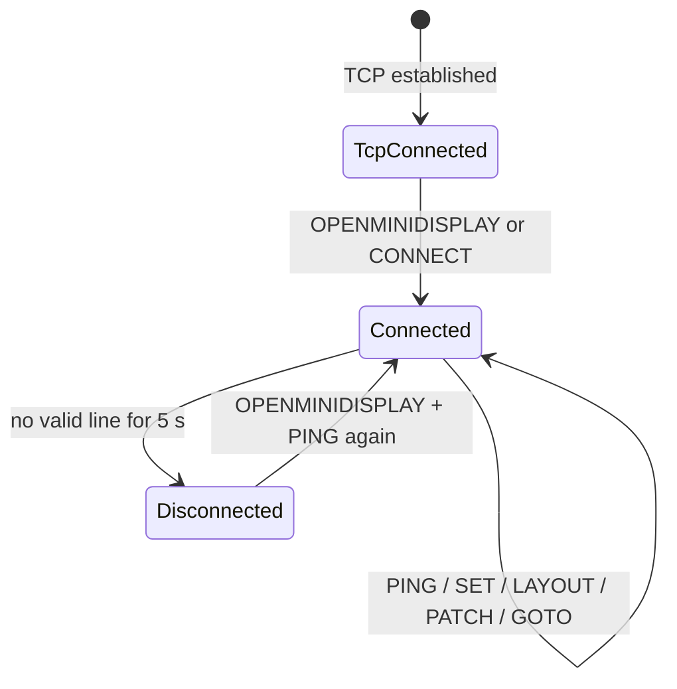

# OpenMiniDisplay Controller Integration (Protocol v1)

**Audience:** Agents and developers building controllers on any platform (Python, Node.js, Go, desktop apps, Home Assistant, etc.).

**Purpose:** Implement a TCP client that drives an OpenMiniDisplay Android device correctly.

| Meta | Value |
|------|-------|
| Protocol version | **1** |
| Transport port | **15180** |
| Encoding | UTF-8 |
| Framing | One command per line, terminated by `\n` |
| Display app | OpenMiniDisplay Android (`minSdk 28`) |

> **Normative keywords:** MUST, MUST NOT, SHOULD, MAY (RFC 2119 sense).

---

## 1. Agent quick start

Minimal integration loop:

```text
1. TCP connect to <display-ip>:15180
2. send "OPENMINIDISPLAY\n"
3. every ≤2 s send "PING\n"
4. send "SET title Hello\n" (and other SET commands)
5. keep the socket open
```

Bash smoke test (same LAN):

```bash
printf 'OPENMINIDISPLAY\nPING\nSET title Hello\n' | nc <display-ip> 15180
```

Reference implementations in this repo:

| Artifact | Path |
|----------|------|
| Bash layout loop | `scripts/layout-test.sh` |
| Bash connect test | `scripts/connect-test.sh` |
| Python minimal client | `docs/examples/reference_client.py` |
| Layout JSON Schema | `docs/schemas/layout.v1.schema.json` |

---

## 2. Transport

| Property | Requirement |
|----------|-------------|
| Protocol | TCP |
| Host | IP of the Android device on LAN |
| Port | **15180** |
| Byte order | N/A (text) |
| Encoding | **UTF-8** |
| Message delimiter | **LF (`\n`)** — one command per line |
| Responses | Display **does not** send text replies (fire-and-forget) |
| Concurrent clients | **Single active session** — a new TCP connection replaces the previous one |

Controllers MUST NOT wait for an ACK before sending the next command. Liveness is inferred from the TCP connection staying open and periodic heartbeats.

---

## 3. Connection lifecycle (controller view)



### Timing constants

| Constant | Value | Notes |
|----------|-------|-------|
| `HEARTBEAT_TIMEOUT` | **5000 ms** | No valid command → display state **DISCONNECTED** |
| `PING_INTERVAL` (recommended) | **≤ 2000 ms** | Keeps session **CONNECTED** |
| `LOW_POWER_DELAY` | 60 s after disconnect | Display-side only |
| `DIM_DURATION` | 10 s linear fade | Display-side only |

### Commands that refresh the heartbeat

Any successfully handled line among:

- `OPENMINIDISPLAY` / `CONNECT` (handshake)
- `PING`
- `SET …` (parsed successfully)
- `LAYOUT …` (valid JSON, ≥1 page)
- `PATCH …` (valid JSON, ≥1 page)
- `GOTO …` (valid index or page id)

---

## 4. Command reference

### 4.1 Grammar

```bnf
line        := command LF
command     := handshake | heartbeat | set | layout | patch | goto
handshake   := "OPENMINIDISPLAY" | "CONNECT" [suffix]
heartbeat   := "PING" [suffix]
set         := "SET" SP widget-id SP value
layout      := "LAYOUT" SP json-object
patch       := "PATCH" SP json-object
goto        := "GOTO" SP target
widget-id   := non-empty token without leading/trailing spaces in id segment
value       := any UTF-8 text (may contain spaces)
target      := page-index | page-id
page-index  := decimal integer (0-based)
page-id     := non-empty string matching a page "id" in current layout
suffix      := optional extra characters (ignored for CONNECT/PING prefix match)
SP          := one ASCII space
```

**Case:** Command keywords are matched **case-insensitively** for `SET`, `LAYOUT`, `PATCH`, `GOTO`, `OPENMINIDISPLAY`, `PING`, and `CONNECT` prefix.

### 4.2 Handshake

| Send | Display effect |
|------|----------------|
| `OPENMINIDISPLAY` | **CONNECTED** — wake screen, max brightness, show dashboard |
| `CONNECT` | Same as handshake (prefix match) |

Example:

```text
OPENMINIDISPLAY
```

### 4.3 Heartbeat

| Send | Display effect |
|------|----------------|
| `PING` | Extends **CONNECTED** by 5 s |

Example:

```text
PING
```

### 4.4 SET (widget data)

```text
SET <widgetId> <value>
```

- **First ASCII space** after `SET` separates `widgetId` from `value`.
- **Everything after the first space** (trimmed) is `value`, including embedded spaces.

| Send | Display effect |
|------|----------------|
| `SET cpu 72.5` | Updates widget `cpu` if type resolves |
| Invalid / blank value | Ignored (no error reply) |

Examples:

```text
SET title Hello World
SET progress 72
SET line 10,20,15,30,25
SET pie CPU:30,MEM:25,IO:20,NET:25
```

### 4.5 LAYOUT (replace structure)

```text
LAYOUT <json>
```

- `<json>` MUST be a **single-line** JSON object (no raw newlines inside the line).
- Replaces the entire layout.
- MUST contain at least one page.

| Send | Display effect |
|------|----------------|
| Valid layout JSON | Pages/grid/widgets replaced; page index clamped |
| Invalid JSON / empty pages | Ignored |

### 4.6 PATCH (merge pages)

```text
PATCH <json>
```

- JSON shape: `{ "pages": [ … ] }`
- Each page is merged by **`id`**: existing page replaced, unknown page appended.

### 4.7 GOTO (switch page)

```text
GOTO <index>
GOTO <pageId>
```

| Send | Display effect |
|------|----------------|
| `GOTO 0` | First page (0-based), **animated** slide |
| `GOTO focus` | Page with `"id":"focus"`, animated |

Only meaningful when layout has **2+ pages**. With 1 page, display does not enable swipe; GOTO still updates internal index.

---

## 5. Layout schema (structure)

Layout describes **where** widgets are placed. Values come from **`SET`**, not from layout JSON.

Validate with: [`docs/schemas/layout.v1.schema.json`](schemas/layout.v1.schema.json)

### 5.1 Top-level object

```json
{
  "version": 1,
  "pages": [ { "...": "..." } ]
}
```

| Field | Required | Description |
|-------|----------|-------------|
| `version` | No (default `1`) | Schema version |
| `pages` | **Yes** | Non-empty array of pages |

### 5.2 Page object

```json
{
  "id": "overview",
  "grid": { "rows": 3, "cols": 4, "gap": 8, "padding": 16 },
  "widgets": [ { "...": "..." } ]
}
```

| Field | Default | Description |
|-------|---------|-------------|
| `grid.rows` | `1` | Grid rows (≥1) |
| `grid.cols` | `1` | Grid columns (≥1) |
| `grid.gap` | `8` | Gap dp between cells |
| `grid.padding` | `16` | Page padding dp |

### 5.3 Widget object

```json
{
  "id": "cpu",
  "type": "ring",
  "row": 0,
  "col": 0,
  "rowSpan": 1,
  "colSpan": 1,
  "style": "body",
  "label": "CPU"
}
```

| Field | Required | Values |
|-------|----------|--------|
| `id` | Yes | Unique string; used in `SET` |
| `type` | Yes | `text`, `metric`, `progress`, `ring`, `line`, `bar`, `pie` |
| `row`, `col` | Yes | 0-based grid origin |
| `rowSpan`, `colSpan` | No (default `1`) | Cell span |
| `style` | No | `headline`, `body`, `caption`, `metric` |
| `label` | No | Chart label (defaults to `id`) |

### 5.4 Display rendering rules (for layout authors)

Controllers SHOULD design layouts knowing:

| Rule | Behavior |
|------|----------|
| Orientation | Landscape |
| Vertical scroll | **Not supported** — content clips |
| 1 page | No horizontal swipe |
| 2+ pages | Infinite horizontal swipe + page dots |
| 1 widget on page | **Borderless** full-screen widget |
| 2+ widgets on page | Card chrome + grid |

---

## 6. Data formats (`SET` values)

Widget type is taken from **current layout** for that `id`. If not in layout, type is inferred from id name (`progress`, `ring`, `line`, `bar`, `pie`, `metric`, else `text`).

| Type | Value format | Parsing |
|------|--------------|---------|
| `text`, `metric` | Any string | Used as-is |
| `progress`, `ring` | Number 0–100 | Optional `%` suffix; clamped 0–100 |
| `line`, `bar` | Comma-separated floats | `10, 20.5, 3` |
| `pie` | `label:value` pairs OR comma numbers | `CPU:30,MEM:70` or `30,70` → S1, S2… |

---

## 7. Recommended client architecture

```text
OpenMiniDisplayClient
├── TcpConnection        # connect(), reconnect(), single socket
├── HeartbeatScheduler   # interval ≤ 2 s → PING
├── CommandWriter        # send_line(cmd) with UTF-8 + \n
├── LayoutStore          # optional local copy of last LAYOUT
└── DataCache            # widgetId → last SET value (for reconnect replay)
```

### 7.1 Reconnect strategy (SHOULD)

1. On disconnect → exponential backoff reconnect.
2. After reconnect → `OPENMINIDISPLAY`.
3. If layout was customized → resend `LAYOUT …`.
4. Resend all cached `SET` values.
5. Restart heartbeat timer.

### 7.2 Threading

- One writer thread/coroutine serializing lines onto the socket is sufficient.
- Heartbeat and data updates MAY share the same queue.

---

## 8. Reference sessions

### 8.1 Default layout — data only

Display ships with a default 3-page layout. Controller only sends data:

```text
OPENMINIDISPLAY
PING
SET title Server Room
SET metric 23.5 C
SET progress 65
PING
```

### 8.2 Custom layout + live data

```text
OPENMINIDISPLAY
LAYOUT {"version":1,"pages":[{"id":"dash","grid":{"rows":2,"cols":2,"gap":8,"padding":16},"widgets":[{"id":"title","type":"text","row":0,"col":0,"colSpan":2,"style":"headline"},{"id":"cpu","type":"ring","row":1,"col":0},{"id":"mem","type":"progress","row":1,"col":1}]}]}
PING
SET title Production
SET cpu 72
SET mem 54
PING
```

### 8.3 Multi-page carousel

```text
OPENMINIDISPLAY
LAYOUT {"version":1,"pages":[{"id":"a","grid":{"rows":1,"cols":1,"padding":0},"widgets":[{"id":"metric","type":"metric","row":0,"col":0,"style":"metric"}]},{"id":"b","grid":{"rows":1,"cols":1,"padding":0},"widgets":[{"id":"status","type":"text","row":0,"col":0,"style":"headline"}]}]}
PING
SET metric 100%
SET status All systems go
GOTO 0
PING
GOTO 1
PING
GOTO b
```

---

## 9. Conformance checklist

Before shipping a controller client, verify:

- [ ] Connects to port **15180**
- [ ] Sends `OPENMINIDISPLAY` immediately after TCP connect
- [ ] Sends `PING` at least every **2 s** while connected
- [ ] `SET` with spaces in value works (`SET title Hello World`)
- [ ] `LAYOUT` JSON is single-line UTF-8
- [ ] After reconnect, layout + data are replayed
- [ ] Handles display not responding (no ACK) without deadlock
- [ ] Tested against `./scripts/layout-test.sh` or `docs/examples/reference_client.py`

---

## 10. Versioning

| Protocol v1 | Android app | Breaking changes |
|-------------|-------------|------------------|
| Initial | ≥ 1.0 | — |

Future changes MUST increment layout `version` or this document's protocol version. Controllers SHOULD ignore unknown JSON fields.

---

## 11. Troubleshooting

| Symptom | Likely cause | Fix |
|---------|--------------|-----|
| Display dims after ~5 s | No `PING` / commands | Send heartbeat every ≤2 s |
| Updates ignored | Not connected / wrong id | Send handshake first; match widget `id` in layout |
| `LAYOUT` has no effect | Invalid JSON or empty pages | Validate against schema |
| Connection drops when reconnecting | Single-client design | Close old socket before opening new one |
| Cannot connect | Firewall / wrong IP | Same LAN; check device Wi‑Fi IP |

---

## 12. Related documents

| Document | Audience |
|----------|----------|
| [`AGENTS.md`](../AGENTS.md) | Agents modifying the **Android app** |
| [`README.md`](../README.md) | Human overview + license |
| [`LICENSE`](../LICENSE) | Apache-2.0 |

**Maintenance:** When the wire protocol or layout schema changes in the Android app, **`docs/CONTROLLER_INTEGRATION.md` MUST be updated in the same change** (see `AGENTS.md`).
